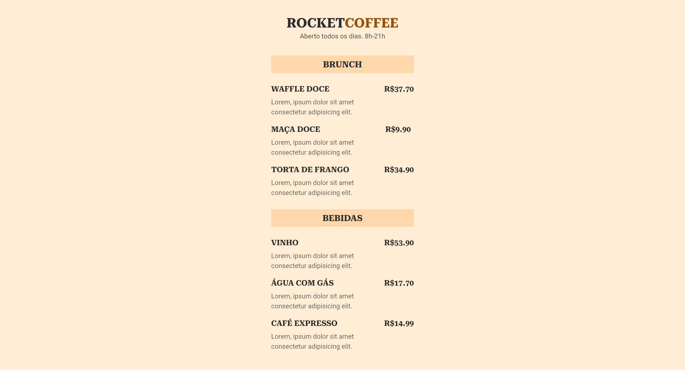

<h1 align="center"> RocketCoffee </h1>

  <a href="#-tecnologias">Tecnologias</a>&nbsp;&nbsp;&nbsp;|&nbsp;&nbsp;&nbsp;
  <a href="#-projeto">Projeto</a>

## 🚀 Tecnologias

Esse projeto foi desenvolvido com as seguintes tecnologias:

- HTML
- CSS

## 💻 Projeto

Este projeto é um cardápio online de uma cafeteria.  

Obs: Projeto construído a partir da 3° edição do evento Maratona Explorer promovido pela [Rocketseat](https://rocketseat.com.br)
